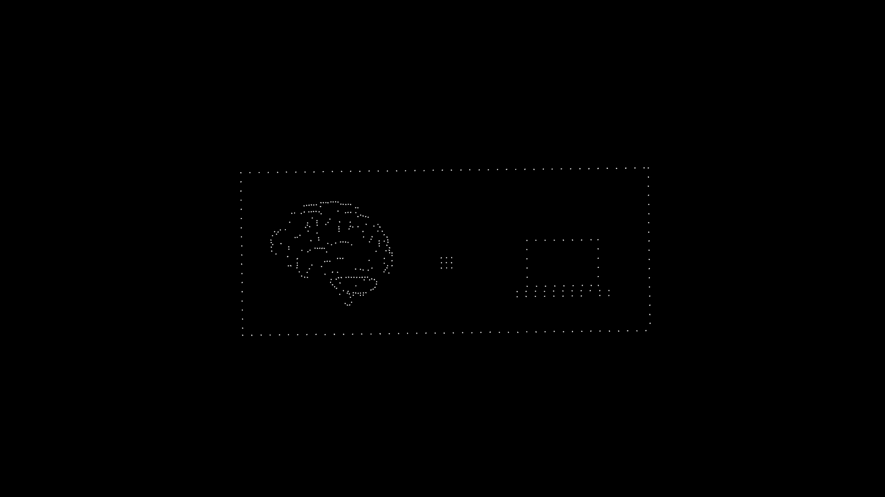

# Isometry Design

Particle-based animation system for Isometry brand visuals. Creates smooth morphing transitions between different dot-based illustrations.



## Quick Start

```bash
# Install dependencies
npm install

# Preview in browser
npm run dev

# Render video
npm run render

# Render specific composition
npx remotion render src/index.ts IsometryPromo ./output.mp4 --codec h264
```

## Project Structure

```
isometry-design/
├── src/
│   ├── config.ts          # ⭐ Main configuration file
│   ├── constants.ts       # Derived constants (auto-generated from config)
│   ├── assets/            # Dot coordinate data
│   │   ├── brainDots.ts
│   │   ├── brainToComputerDots.ts  (BCI scene)
│   │   ├── clinicalDots.ts
│   │   └── assistiveDots.ts
│   ├── scenes/
│   │   ├── Main.tsx       # Main composition (scene orchestration)
│   │   └── SceneSolo.tsx  # Individual scene renderer
│   ├── utils/
│   │   ├── targets.ts     # Point sampling functions
│   │   ├── noise.ts       # Perlin noise for particle movement
│   │   └── easings.ts     # Animation easing functions
│   ├── Root.tsx           # Remotion root (composition registry)
│   └── index.ts           # Entry point
├── scripts/
│   └── generate-asset.ts  # Asset generation tool
├── stills/                # Preview images
└── package.json
```

## Configuration

All tunable parameters are in **`src/config.ts`**:

### Video Settings
```typescript
video: {
  width: 1920,
  height: 1080,
  fps: 30,
  backgroundColor: '#000000',
}
```

### Particle Settings
```typescript
particles: {
  count: 2000,           // Total particles
  defaultSize: 3,        // Dot radius
  color: '#ffffff',      // Dot color
  transitionEasing: 0.08 // Movement speed (0.01-0.15)
}
```

### Timing (in frames @ 30fps)
```typescript
timing: {
  STATE_A: 0,     // Logo hold start
  STATE_B: 90,    // Logo → Brain (3s)
  STATE_C: 180,   // Brain → BCI (3s)
  STATE_D: 300,   // BCI → Clinical (4s)
  STATE_E: 420,   // Clinical → Assistive (4s)
  STATE_F: 540,   // Assistive → Logo (4s)
  STATE_G: 660,   // Logo hold end
  TOTAL_FRAMES: 765,
}
```

### Scene Configuration
Each scene has its own config:

```typescript
scenes: {
  brain: {
    scale: 0.85,        // Size multiplier
    offsetX: 0,         // Horizontal shift
    offsetY: 0,         // Vertical shift
    dotScale: 0.9,      // Individual dot size
    sourceWidth: 540,   // Original image width
    sourceHeight: 395,  // Original image height
  },
  
  clinical: {
    scale: 1.25,
    offsetX: 0,
    offsetY: 60,        // Shifted down
    dotScale: 0.85,
    filterBorder: true, // Remove rectangular border
    borderFilter: {
      leftEdge: 130,    // Filter dots with x < 130
      rightEdge: 1400,  // Filter dots with x > 1400
      topEdge: 310,
      bottomEdge: 960,
      mode: 'edges',    // 'edges' or 'corners'
    },
  },
  // ... more scenes
}
```

## Adding New Scenes

### 1. Generate Asset from Image

Prepare your image:
- Use **white dots on black background**
- PNG format recommended
- Resolution: 1000-2000px width works well

Run the generator:
```bash
# Install jimp if not already installed
npm install jimp

# Generate asset
npx ts-node scripts/generate-asset.ts ./my-image.png myScene

# With options
npx ts-node scripts/generate-asset.ts ./my-image.png myScene --threshold 180 --min-radius 2
```

This creates `src/assets/mySceneDots.ts`.

### 2. Add Configuration

In `src/config.ts`, add a new scene:
```typescript
scenes: {
  // ... existing scenes
  
  myScene: {
    scale: 1.0,
    offsetX: 0,
    offsetY: 0,
    dotScale: 0.85,
    filterBorder: false,
    sourceWidth: 1536,  // From generated file header
    sourceHeight: 1024,
  },
}
```

### 3. Create Sampler Function

In `src/utils/targets.ts`:
```typescript
import { MY_SCENE_DOTS_SOURCE } from "../assets/mySceneDots";

export const sampleMySceneTargets = (): Point[] => {
  const cfg = CONFIG.scenes.myScene;
  return transformAssetToScreen(MY_SCENE_DOTS_SOURCE, {
    sourceWidth: cfg.sourceWidth,
    sourceHeight: cfg.sourceHeight,
    scale: cfg.scale,
    offsetX: cfg.offsetX,
    offsetY: cfg.offsetY,
    dotScale: cfg.dotScale,
    filterBorder: cfg.filterBorder,
    borderFilter: cfg.borderFilter,
  });
};
```

### 4. Add to Main Composition

In `src/scenes/Main.tsx`, add your scene to the state machine and import the sampler.

## Asset Files

Each asset file contains dot coordinates as `[x, y, radius]` tuples:

```typescript
export const BRAIN_DOTS_SOURCE: Array<[number, number, number]> = [
  [270.5, 108.5, 2.3],   // x, y, radius
  [285.2, 112.8, 1.9],
  // ... more dots
];
```

### Current Assets

| Asset | Scene | Source Resolution | Dots |
|-------|-------|-------------------|------|
| `brainDots.ts` | Brain | 540 × 395 | ~200 |
| `brainToComputerDots.ts` | BCI | 1536 × 1049 | ~500 |
| `clinicalDots.ts` | Clinical | 1536 × 1272 | ~1200 |
| `assistiveDots.ts` | Assistive | 1536 × 1237 | ~1100 |

## Rendering

### Development Preview
```bash
npm run dev
# Opens http://localhost:3000
```

### Render Video
```bash
# Default render
npm run render

# Custom output
npx remotion render src/index.ts IsometryPromo ./my-video.mp4 --codec h264

# Higher quality (slower)
npx remotion render src/index.ts IsometryPromo ./output.mp4 --codec h264 --crf 18

# Lower concurrency (if memory issues)
npx remotion render src/index.ts IsometryPromo ./output.mp4 --concurrency 2
```

### Render Single Frame (Still)
```bash
npx remotion still src/index.ts Scene-BrainToComputer ./still.png --frame 0
```

### Available Compositions
- `IsometryPromo` - Full animation sequence
- `Scene-IsometryHold` - Logo only
- `Scene-Brain` - Brain scene
- `Scene-BrainToComputer` - BCI scene
- `Scene-UseCase1` - Clinical scene
- `Scene-UseCase2` - Assistive scene
- `Scene-IsometryEnd` - End logo

## Interactive Dot Editor

A local web-based editor for visually editing dots in each scene.

### Syncing Assets

The editor uses `editor/assets.json` which must stay in sync with `src/assets/*.ts` files.

**One-time sync:**
```bash
npm run sync-assets
```

**Auto-sync while developing:**
```bash
npm run sync-assets:watch
```

This watches for changes in `src/assets/` and automatically updates `editor/assets.json`.

### Running the Editor

```bash
# Start the editor (syncs assets and starts server)
npm run editor
```

Then open **http://localhost:3333** in your browser.

**Tip:** Run `npm run sync-assets:watch` in another terminal while editing to keep assets in sync in real-time.

### Features

- **Visual editing** - See all dots in each scene on a canvas
- **Scene switching** - Toggle between Logo, Brain, BCI, Clinical, Assistive
- **Selection tools:**
  - Click to select single dot
  - Box select (M) for rectangular selection
  - Lasso (L) for freeform selection
  - Select all (⌘A)
- **Editing:**
  - Change color (presets + custom hex)
  - Adjust size with slider
  - Delete selected dots (Del/Backspace)
  - Draw new dots (D)
  - Erase dots (E)
- **Navigation:**
  - Pan (Space + drag)
  - Zoom (scroll wheel or +/-)
- **Export:**
  - Copy asset code to clipboard
  - Download as `.ts` file

### Keyboard Shortcuts

| Action | Key |
|--------|-----|
| Select tool | V |
| Box select | M |
| Lasso select | L |
| Draw dot | D |
| Erase | E |
| Pan | Space + Drag |
| Select all | ⌘/Ctrl + A |
| Deselect | Esc |
| Delete | Delete / Backspace |
| Zoom in/out | Scroll / +/- |
| Reset zoom | 0 |

### Workflow

1. **Start the watcher** (in one terminal):
   ```bash
   npm run sync-assets:watch
   ```

2. **Run the editor** (in another terminal):
   ```bash
   npm run editor
   ```

3. **Edit dots visually** in the browser at http://localhost:3333
   - Add, remove, recolor, resize dots
   - Changes auto-sync to `src/assets/[scene]Dots.ts`

4. **Export and use:**
   - Click "Copy Asset Code" to copy to clipboard
   - Or download as `.ts` file
   - Changes are already saved to `src/assets/`

5. **Re-render video** to see changes:
   ```bash
   npm run render
   ```

---

## Web Integration

For website use, you can:

1. **Export as video** and use HTML5 `<video>` tag
2. **Export frame sequence** for custom JS animation
3. **Use the particle system directly** - the core logic in `targets.ts` and `utils/` can be extracted for canvas/WebGL rendering

### Extracting for Web

The key files for web integration:
- `src/utils/targets.ts` - Point sampling functions
- `src/assets/*.ts` - Dot coordinate data
- `src/config.ts` - Configuration

These can be used with any canvas/WebGL framework (Three.js, p5.js, etc.).

## Tips

### Smooth Transitions
- Ensure similar dot counts between scenes
- `padPoints()` automatically fills gaps with nearby duplicates
- Lower `transitionEasing` = smoother but slower

### Performance
- Reduce `particles.count` for faster preview
- Use `--concurrency 2-4` for rendering on limited RAM
- Asset files are just data - rendering is the slow part

### Border Filtering
If your source image has a dotted border/frame:
- Set `filterBorder: true`
- Adjust edge thresholds until border disappears
- Use `mode: 'edges'` for full edge removal
- Use `mode: 'corners'` for partial removal (like BCI scene)

## License

Private - Isometry internal use only.
